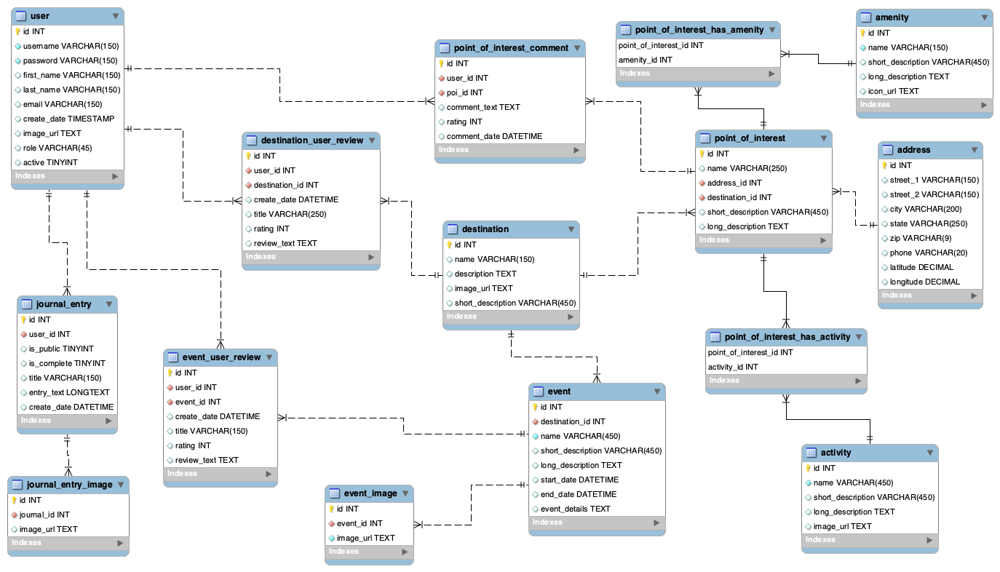

## Tripping

### Midterm Group Project for Skill Distillery

### Team Enthroned Slaughter
* Cecil Kitch (SCRUM master)
* Craig Dreiling (DBA)
* Ryan Harrington (Repo owner)
* Chana Cohn (JPA/documentation)
* All: front end, back end, graphics

### Overview
Tripping is a travel app that allows the user to view travel sites in Colorado, along
with associated activities and events for different sites. Sites can be displayed with
amenities and a google maps location.

A visitor can browse to destinations, activities and events. Destinations include points of interest, 
and points of interest have a map location, business address, phone number and associated
amenities.

The user can create an account and add destinations, events and points of interest to a travel journal 
which is associated with their profile. The user can also delete or update their entries.

An administrator can make a user account inactive and perform additional functions.

### Technologies used
* Spring MVC
* JPA/Hibernate/JPQL
* Mysql
* Paperkit
* bootstrap
* Entities Grid
* CSS
* Github
* MAMP
* font-awesome
* paperkit
* slack
* hibernate
* grade

### How to Use
* A user can browse activities, events and destinations without logging in.
* A user can create an account or login with an existing account.
* Activities map to points of interest. These can be added to a trip.
* Destinations can be added to a journal, and they also map to points of interest
(which can be added to a trip).
* Events can be added to a trip.
* A user's journal can have a list of items yet to be completed.
* Once the journal item is checked off as completed, the entry is moved to "completed trips."
* Upcoming and completed trips can be viewed.
* User entries can be made public or private.

### Lessons Learned
* There was a learning curve to implementing the front end. The result is worthwhile,
but there was a lot of effort expended to making the front end work. This required
forgoing some functionality that the team would have liked to include. It also made the
site look very good.
* Design decisions need to be finalized early. Late decisions and changes added some
pressure to getting features implemented.
* A buffer needs to be built into the timeframe to accommodate fixing outstanding
issues. There was pressure to fix features that needed to be included.
* The design and implementation input the team received early on and during development
was immensely helpful. The team utilized instructor resources well when needed.

### Database Diagram

